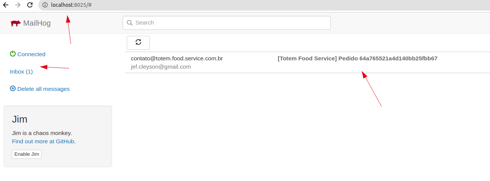

## Executando a aplicação

O comando abaixo inicia todos os componentes da infraestrutura
- MongoDB **
- MailHog **
- Payment Gateway ***
- Totem Food Service ***

** Imagens oficias encontradas no Docker Hub </br>
*** Aplicações que realizam build para subir

1. Comando para inicialização
```
docker-compose -f docker-compose.yaml up -d --build
```
> Observação: Para maior agilidade nos testes da aplicação pode-se executar o 'docker-compose-docker-hub.yaml' onde se encontra as aplicações em sua última versão.

2. Verificar se todos os componentes estão em execução
```
docker-compose -f docker-compose.yaml ps
```
```
       Name                     Command                  State                                             Ports                                       
-------------------------------------------------------------------------------------------------------------------------------------------------------
mailhog              MailHog                          Up             0.0.0.0:1025->1025/tcp,:::1025->1025/tcp, 0.0.0.0:8025->8025/tcp,:::8025->8025/tcp
mongo-dev            docker-entrypoint.sh mongod      Up (healthy)   0.0.0.0:27017->27017/tcp,:::27017->27017/tcp                                      
payment-gateway      python gateway.py                Up             0.0.0.0:5000->5000/tcp,:::5000->5000/tcp                                          
totem-food-service   java -jar /opt/app/totem-f ...   Up             0.0.0.0:8080->8080/tcp,:::8080->8080/tcp
```

3. Importar as collections do Postman para realizar as requisições
4. Com a aplicação em execução temos acesso as seguintes serviços e portas
- MongoDB: 27017
- MailHog: 8025
- Payment Gateway: 5000
- Totem Food Service: 8080

5. Quando o pedido transitar de 'NEW' para 'WAITING_PAYMENT' deve-ser chamar o endpoint para criar o pagamento
6. O processo de criar pagamento irá chamar o mock que está no serviço 'Payment Gateway'
7. Para que o pagamento transite de 'PENDING' para 'COMPLETED' e o pedido para 'RECEIVED' devemos chamar o endpoint de callback de pagamento
8. Os dados para serem inputados no endpoint de callback se encontram no serviço que realiza o mock de pagamento 'Payment Gateway'
9. Para visualizar, executar o comando abaixo e em seguida verificar o campo body da requisição, onde se encontra o 'orderId' e o 'token'
```
docker-compose -f docker-compose.yaml logs -f payment-gateway
```
```
Attaching to payment-gateway
payment-gateway       |  * Serving Flask app 'gateway' (lazy loading)
payment-gateway       |  * Environment: production
payment-gateway       |    WARNING: This is a development server. Do not use it in a production deployment.
payment-gateway       |    Use a production WSGI server instead.
payment-gateway       |  * Debug mode: off
payment-gateway       | WARNING: This is a development server. Do not use it in a production deployment. Use a production WSGI server instead.
payment-gateway       |  * Running on all addresses (0.0.0.0)
payment-gateway       |  * Running on http://127.0.0.1:5000
payment-gateway       |  * Running on http://172.25.0.3:5000
payment-gateway       | Press CTRL+C to quit
payment-gateway       | [2023-07-07 01:09:30,837] INFO in gateway: {
payment-gateway       |   "url": "http://payment-gateway:5000/v1/online-payment",
payment-gateway       |   "path": "/v1/online-payment",
payment-gateway       |   "args": {},
payment-gateway       |   "headers": {
payment-gateway       |     "Accept": "application/json, application/*+json",
payment-gateway       |     "Content-Type": "application/json",
payment-gateway       |     "Content-Length": "98",
payment-gateway       |     "Host": "payment-gateway:5000",
payment-gateway       |     "Connection": "Keep-Alive",
payment-gateway       |     "User-Agent": "Apache-HttpClient/4.5.14 (Java/17.0.2)",
payment-gateway       |     "Accept-Encoding": "gzip,deflate"
payment-gateway       |   },
payment-gateway       |   "body": {
payment-gateway       |     "orderId": "64a765521a4d140bb25fbb67",
payment-gateway       |     "price": 30.0,
payment-gateway       |     "token": "64078c78-fc83-4be4-8e78-25c91bb99dce"
payment-gateway       |   }
payment-gateway       | }
payment-gateway       | 172.25.0.4 - - [07/Jul/2023 01:09:30] "POST /v1/online-payment HTTP/1.1" 200 -
```
10. Após realizar a chamada da callback de pagamento e receber sucesso o pedido poderá ser transitado para os demais estados
11. Caso o usuário se identifique durante o processo de pedido, será enviado um e-mail avisando quando o pedido transitar para o estado de 'READY'. Para verificar a notificação de envio utilizar a interface gráfica do 'MailHog'
- MailHog: [http://localhost:8025/](http://localhost:8025/)

