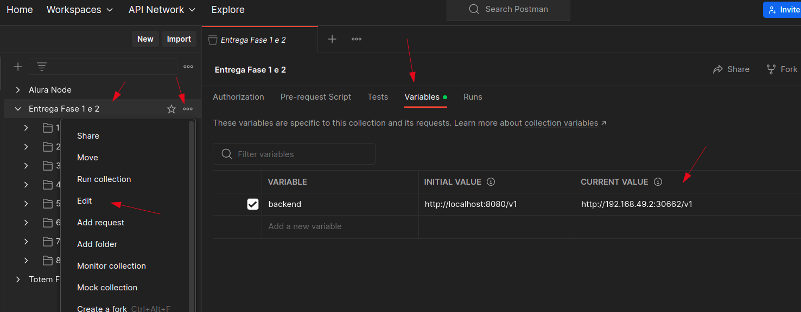

## Requisitos

É pré-requisito que a máquina que irá executar os passos abaixo ja tenha instalado:

- Docker
- Minikube
- Helm
- Kubectl

## Executando a aplicação

Cada helm chart é responsável por subir uma aplicação, ao final do processo teremos todas as aplicações abaixo rodando no namespace especificado abaixo.

- MongoDB **
- MailHog **
- Payment Gateway **
- Totem Food Service **

** Helm Charts se encontram na pasta [charts](../../charts)

1. Comando para inicialização
```
minikube start
```
2. Comando para adicionar um novo nó no cluster
```
minikube node add
```
```
😄  Adding node m02 to cluster minikube
👍  Starting worker node minikube-m03 in cluster minikube
🚜  Pulling base image ...
🔥  Creating docker container (CPUs=2, Memory=2200MB) ...
❗  Executing "docker container inspect minikube-m02 --format={{.State.Status}}" took an unusually long time: 5.9152809s
💡  Restarting the docker service may improve performance.
🐳  Preparing Kubernetes v1.26.3 on Docker 23.0.2 ...
🔎  Verifying Kubernetes components...
🏄  Successfully added m03 to minikube!
```

3. Mostra todos os contextos do kube config
```
kubectl config get-contexts
```
```
CURRENT   NAME                                                                         CLUSTER                                                                      AUTHINFO                                                                     NAMESPACE
          arn:aws:eks:sa-east-1:xxx3yyyyy:cluster/developing        arn:aws:eks:sa-east-1:xxx3yyyyy:cluster/developing        arn:aws:eks:sa-east-1:xxx3yyyyy:cluster/developing        
*         minikube                                                                     minikube                                                                     minikube                                                                     default
```

4. Verifica o contexto atual do kubectl
```
kubectl config current-context
```

> Observação: Se não tiver setado o contexto do minikube utilizar o comando do próximo passo para setar.

5. Seta o contexto do minikube
```
kubectl config set-context minikube
```

6. Iremos utilizar o namespace 'totem-apps' para subir as aplicações, para isto iremos criar o namespace
```
kubectl create ns totem-apps
```
```
namespace/totem-apps created
```

7. Listando os pods do namespace
```
kubectl get pods -n totem-apps
```
```
No resources found in totem-apps namespace.
```

8. Subindo as aplicações

> Observação: Minikube pode apresentar problemas na resolução de endereços utilizando o próprio dns do cluster, para resolver este problema executar o comando abaixo.

CoreDNS

```
kubectl rollout restart deployment coredns --namespace kube-system
```
```
deployment.apps/coredns restarted
```

MongoDB

```
helm install mongo ./mongodb-chart --namespace totem-apps
```
```
NAME: mongo
LAST DEPLOYED: Tue Aug 29 22:50:20 2023
NAMESPACE: totem-apps
STATUS: deployed
REVISION: 1
TEST SUITE: None
```

MailHog

```
helm install mailhog ./mailhog-chart --namespace totem-apps
```
```
NAME: mailhog
LAST DEPLOYED: Tue Aug 29 22:53:05 2023
NAMESPACE: totem-apps
STATUS: deployed
REVISION: 1
TEST SUITE: None
```

Payment Gateway

```
helm install payment ./payment-gateway-chart --namespace totem-apps
```
```
NAME: payment
LAST DEPLOYED: Tue Aug 29 22:54:37 2023
NAMESPACE: totem-apps
STATUS: deployed
REVISION: 1
TEST SUITE: None
```

Totem Food API

```
helm install totem ./totem-food-chart --namespace totem-apps
```
```
NAME: totem
LAST DEPLOYED: Tue Aug 29 22:55:31 2023
NAMESPACE: totem-apps
STATUS: deployed
REVISION: 1
TEST SUITE: None
```

9. Verificar se todas aplicações estão rodando

```
kubectl get pods --namespace totem-apps
```
```
NAME                                       READY   STATUS    RESTARTS   AGE
mailhog-mailhog-bdb984877-6cjv4            1/1     Running   0          7m30s
mongo-mongodb-746bdc85bb-sncbh             1/1     Running   0          32m
payment-payment-gateway-6cdb5f976c-fcj59   1/1     Running   0          28m
totem-totem-food-5ff59c5998-p5hch          1/1     Running   0          23m
```

> Observação: Todas as aplicações devem estar no estado de 'Running', qualquer estado diferente verificar os 
> logs da aplicação que está com erro e se constar erro de resolução do nome de alguma aplicação dependente reiniciar o coredns

10. Criar tunel entre a máquina local e o minikube

```
minikube tunnel
```
```
Status:	
	machine: minikube
	pid: 927794
	route: 10.96.0.0/12 -> 192.168.49.2
	minikube: Running
	services: [totem-totem-food-service-lb, mailhog-mailhog-service-lb]
    errors: 
		minikube: no errors
		router: no errors
		loadbalancer emulator: no errors
❗  Executing "docker container inspect minikube --format={{.State.Status}}" took an unusually long time: 2.120434522s
💡  Restarting the docker service may improve performance.
```

11. Copiar o segundo IP do 'route' mostrado no resultado do comando acima.
```
192.168.49.2
```

12. Verificar a porta exposta pelo Load Balancer
```
kubectl get svc --namespace totem-apps
```
```
NAME                              TYPE           CLUSTER-IP       EXTERNAL-IP      PORT(S)             AGE
mailhog-mailhog-service           ClusterIP      10.102.161.165   <none>           1025/TCP,8025/TCP   17m
mailhog-mailhog-service-lb        LoadBalancer   10.108.82.173    10.108.82.173    8085:30535/TCP      17m
mongo-mongodb-service             ClusterIP      10.106.165.187   <none>           27017/TCP           42m
payment-payment-gateway-service   ClusterIP      10.99.35.182     <none>           5000/TCP            38m
totem-totem-food-service          ClusterIP      10.98.192.113    <none>           8080/TCP            33m
totem-totem-food-service-lb       LoadBalancer   10.107.216.153   10.107.216.153   8080:30662/TCP      33m
```

13. Rodar comando abaixo para garantir que o CoreDNS resolva os endereços

Algumas vezes o CoreDNS apresenta problemas na resolução de DNS dos micros serviços utilizando o minikube, para resolver 
este problema é necessário reiniciar o micro serviço de coredns

CoreDNS

```
kubectl rollout restart deployment coredns --namespace kube-system
```
```
deployment.apps/coredns restarted
```

14. Acessar no navegador o seguinte endereço 'IP':'PORTA':
- 'IP' resultado do passo 11 
- 'PORTA' segunda porta do Load Balancer

Acesso para o Dashboard do mailhog - Para acessar os emails do usuário quando o pedido for finalizado
```
http://192.168.49.2:30535
```

Acesso para a API do totem food
```
http://192.168.49.2:30662
```

---

15. Importar as collections do Postman para realizar as requisições
16. Substituir o environment da collection do Postman pelo IP e PORTA atual do minikube conforme explicações acima.



17. Quando o pedido transitar de 'NEW' para 'WAITING_PAYMENT' deve-ser chamar o endpoint para criar o pagamento
18. O processo de criar pagamento irá chamar o mock que está no serviço 'Payment Gateway'
19. Para que o pagamento transite de 'PENDING' para 'COMPLETED' e o pedido para 'RECEIVED' devemos chamar o endpoint de callback de pagamento
20. Os dados para serem inputados no endpoint de callback se encontram no serviço que realiza o mock de pagamento 'Payment Gateway'
21. Para visualizar, executar o comando abaixo e em seguida verificar o campo body da requisição, onde se encontra o 'orderId' e o 'token'

Pegar o nome do Pod do Gateway de pagamento
```
kubectl get pods --namespace totem-apps
```
```
NAME                                       READY   STATUS    RESTARTS   AGE
mailhog-mailhog-bdb984877-6cjv4            1/1     Running   0          54m
mongo-mongodb-746bdc85bb-sncbh             1/1     Running   0          79m
payment-payment-gateway-7588785f4d-pbg7v   1/1     Running   0          4m21s
totem-totem-food-5ff59c5998-p5hch          1/1     Running   0          69m
```

Mostrar os logs do Pod de Gateway de pagamento

```
kubectl logs -f payment-payment-gateway-7588785f4d-pbg7v --namespace totem-apps
```
```
 * Serving Flask app 'gateway' (lazy loading)
 * Environment: production
   WARNING: This is a development server. Do not use it in a production deployment.
   Use a production WSGI server instead.
 * Debug mode: off
WARNING: This is a development server. Do not use it in a production deployment. Use a production WSGI server instead.
 * Running on all addresses (0.0.0.0)
 * Running on http://127.0.0.1:5000
 * Running on http://10.244.1.11:5000
Press CTRL+C to quit
[2023-08-30 03:06:17,799] INFO in gateway: {
  "url": "http://payment-payment-gateway-service.totem-apps.svc.cluster.local:5000/v1/online-payment",
  "path": "/v1/online-payment",
  "args": {},
  "headers": {
    "Accept": "application/json, application/*+json",
    "Content-Type": "application/json",
    "Content-Length": "98",
    "Host": "payment-payment-gateway-service.totem-apps.svc.cluster.local:5000",
    "Connection": "Keep-Alive",
    "User-Agent": "Apache-HttpClient/4.5.14 (Java/17.0.2)",
    "Accept-Encoding": "gzip,deflate"
  },
  "body": {
    "orderId": "64eeae39837eff576e53962e",
    "price": 30.0,
    "token": "8589b28f-ae66-44ff-8701-b5b3f19d0a58"
  }
}
10.244.1.8 - - [30/Aug/2023 03:06:17] "POST /v1/online-payment HTTP/1.1" 200 -
```

22. Após realizar a chamada da callback de pagamento e receber sucesso o pedido poderá ser transitado para os demais estados
23. Caso o usuário se identifique durante o processo de pedido, será enviado um e-mail avisando quando o pedido transitar para o estado de 'READY'. Para verificar a notificação de envio utilizar a interface gráfica do 'MailHog'


