[](https://sonarcloud.io/summary/new_code?id=totem-food-service-4787bf24ba181ac258cb520837a657896a92044c)

[](https://sonarcloud.io/summary/new_code?id=totem-food-service-4787bf24ba181ac258cb520837a657896a92044c)
[](https://sonarcloud.io/summary/new_code?id=totem-food-service-4787bf24ba181ac258cb520837a657896a92044c)
[](https://sonarcloud.io/summary/new_code?id=totem-food-service-4787bf24ba181ac258cb520837a657896a92044c)
[](https://sonarcloud.io/summary/new_code?id=totem-food-service-4787bf24ba181ac258cb520837a657896a92044c)

---

## Indice

Instrução para uso da aplicação se encontra no tópico [Executando a Aplicação](#executando-a-aplicação), os demais tópicos abaixo são documentações complementares.

1. [Postman](#postman-da-aplicação)
2. [Swagger](#swagger-da-aplicação)
3. [Visão Geral](#visão-geral-da-aplicação)
4. [Máquina de Estado](#máquinas-de-estado)
5. [Jornada dos Atores](#jornada-dos-atores)
7. [Requisitos Desenvolvimento](#projeto)
6. [Inicializando a infraestrutura para desenvolvimento](#executar-docker-compose-para-desenvolvimento)
8. [Processo de Desenvolvimento](#processo-de-execução-das-tasks)

---

## Postman da Aplicação

Importar o arquivo abaixo no Postman:

- [collection_postman](./documentation/postman-collections/Entrega%20Fase%201.postman_collection.json)

## Swagger da Aplicação

Para visualizar o swagger copiar o conteúdo do arquivo
- [Swagger Totem](./documentation/swaggers/totem-food-service.yaml)

após copiar cole no site do [swagger editor](https://editor.swagger.io/).

### Swagger Totem

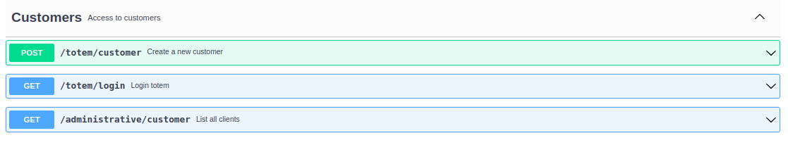
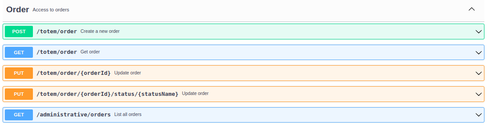
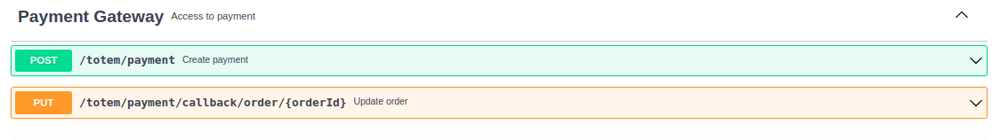
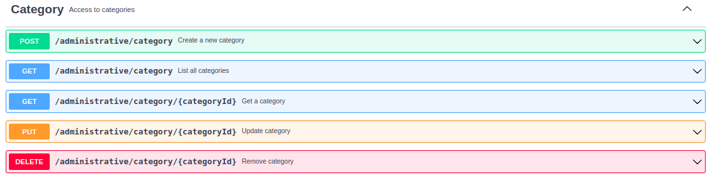
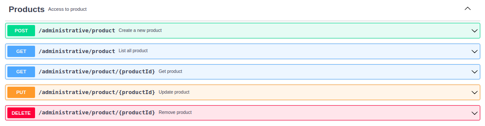

---

## Visão Geral da Aplicação

Visão global da aplicação em funcionamento

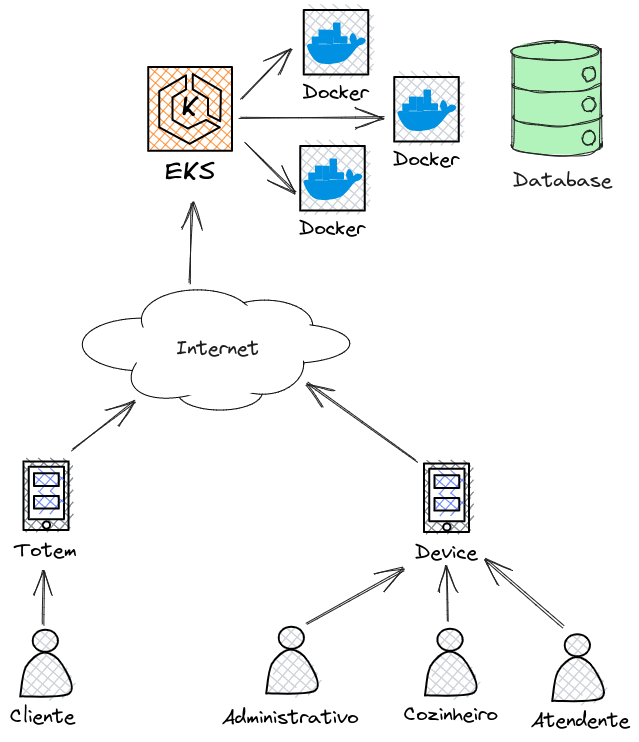

---

## Máquinas de Estado

- Order

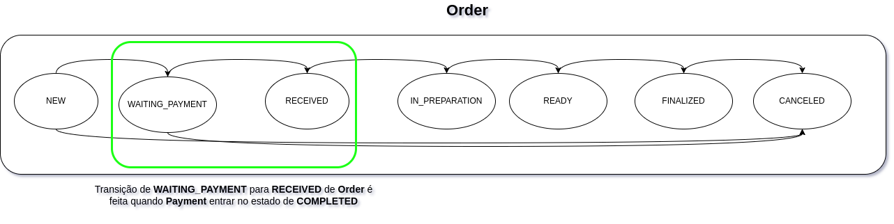

- Payment

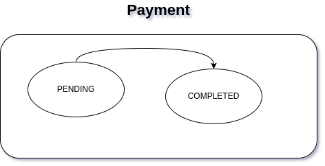

---

## Jornada dos Atores

* Administrador

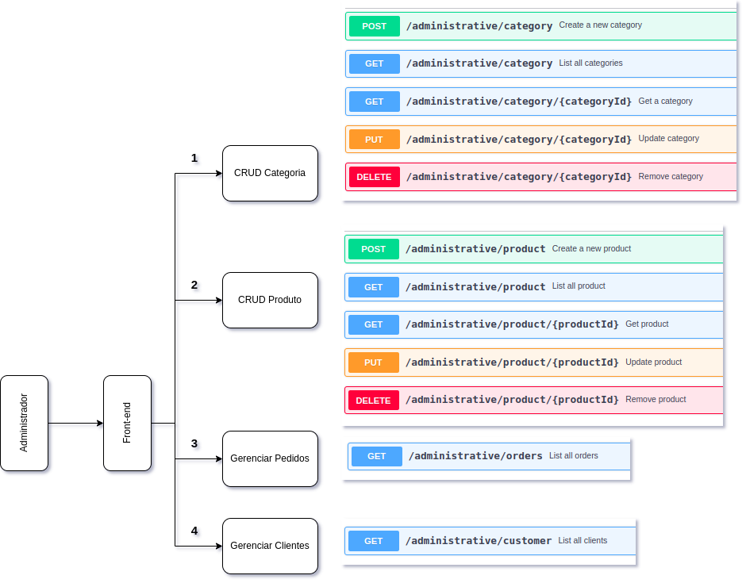

* Cliente

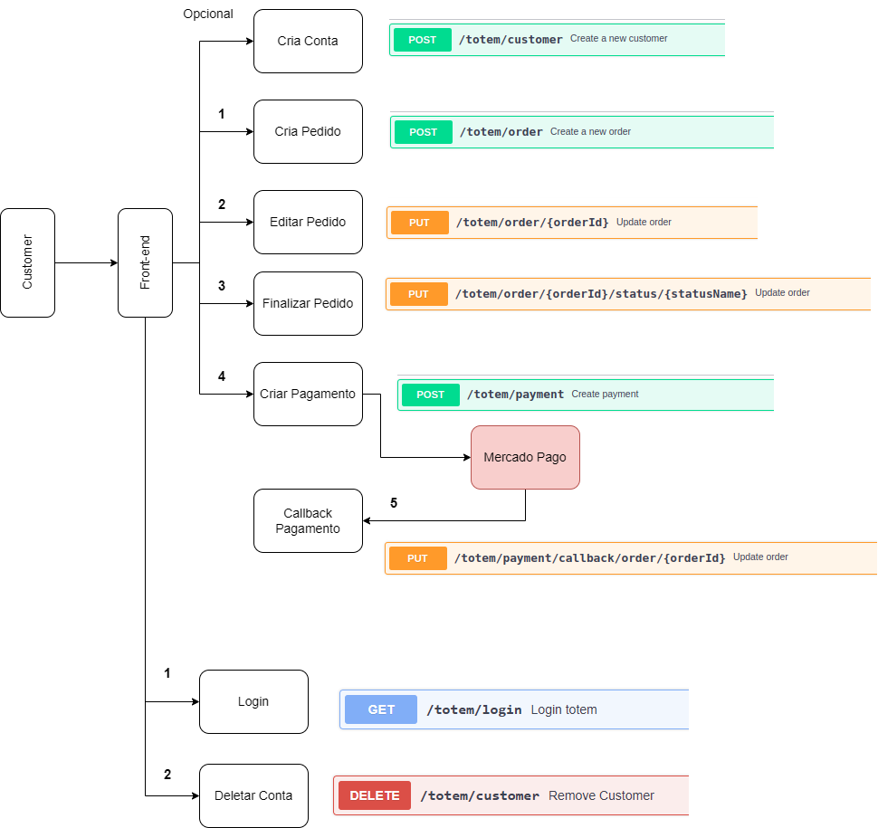

* Cozinha x Atendente

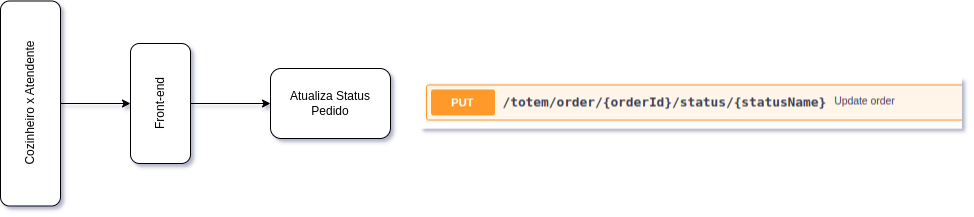

* Monitor

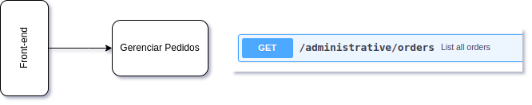

---

## Executar docker-compose para desenvolvimento

executar o commando na raiz do pasta do projeto

Iniciar somente a infraestrutura e executar o Totem Food Service pela IDE
```
./script-start-dev.sh dev
```
Iniciar todos os componentes
```
./script-start-dev.sh
```
Parar todos os componentes
```
./script-stop-dev.sh
```
Ver os logs da aplicação: `mongo-dev`, `totem-food-service`, `payment-gateway` e `mailhog`
 - Exemplo:
```
./script-logs-dev.sh mongo
```
```
./script-logs-dev.sh totem-food-service
```

## Executando a aplicação

O comando abaixo inicia todos os componentes da infraestrutura
- MongoDB **
- MailHog **
- Payment Gateway ***
- Totem Food Service ***

** Imagens oficias encontradas no Docker Hub </br>
*** Aplicações que realizam build para subir

1. Comando para inicialização
```
docker-compose -f docker-compose.yaml up -d --build
```
> Observação: Para maior agilidade nos testes da aplicação pode-se executar o 'docker-compose-docker-hub.yaml' onde se encontra as aplicações em sua última versão.

2. Verificar se todos os componentes estão em execução
```
docker-compose -f docker-compose.yaml ps
```
```
       Name                     Command                  State                                             Ports                                       
-------------------------------------------------------------------------------------------------------------------------------------------------------
mailhog              MailHog                          Up             0.0.0.0:1025->1025/tcp,:::1025->1025/tcp, 0.0.0.0:8025->8025/tcp,:::8025->8025/tcp
mongo-dev            docker-entrypoint.sh mongod      Up (healthy)   0.0.0.0:27017->27017/tcp,:::27017->27017/tcp                                      
payment-gateway      python gateway.py                Up             0.0.0.0:5000->5000/tcp,:::5000->5000/tcp                                          
totem-food-service   java -jar /opt/app/totem-f ...   Up             0.0.0.0:8080->8080/tcp,:::8080->8080/tcp
```

3. Importar as collections do Postman para realizar as requisições
4. Com a aplicação em execução temos acesso as seguintes serviços e portas
- MongoDB: 27017
- MailHog: 8025
- Payment Gateway: 5000
- Totem Food Service: 8080

5. Quando o pedido transitar de 'NEW' para 'WAITING_PAYMENT' deve-ser chamar o endpoint para criar o pagamento
6. O processo de criar pagamento irá chamar o mock que está no serviço 'Payment Gateway'
7. Para que o pagamento transite de 'PENDING' para 'COMPLETED' e o pedido para 'RECEIVED' devemos chamar o endpoint de callback de pagamento
8. Os dados para serem inputados no endpoint de callback se encontram no serviço que realiza o mock de pagamento 'Payment Gateway'
9. Para visualizar, executar o comando abaixo e em seguida verificar o campo body da requisição, onde se encontra o 'orderId' e o 'token'
```
docker-compose -f docker-compose.yaml logs -f payment-gateway
```
```
Attaching to payment-gateway
payment-gateway       |  * Serving Flask app 'gateway' (lazy loading)
payment-gateway       |  * Environment: production
payment-gateway       |    WARNING: This is a development server. Do not use it in a production deployment.
payment-gateway       |    Use a production WSGI server instead.
payment-gateway       |  * Debug mode: off
payment-gateway       | WARNING: This is a development server. Do not use it in a production deployment. Use a production WSGI server instead.
payment-gateway       |  * Running on all addresses (0.0.0.0)
payment-gateway       |  * Running on http://127.0.0.1:5000
payment-gateway       |  * Running on http://172.25.0.3:5000
payment-gateway       | Press CTRL+C to quit
payment-gateway       | [2023-07-07 01:09:30,837] INFO in gateway: {
payment-gateway       |   "url": "http://payment-gateway:5000/v1/online-payment",
payment-gateway       |   "path": "/v1/online-payment",
payment-gateway       |   "args": {},
payment-gateway       |   "headers": {
payment-gateway       |     "Accept": "application/json, application/*+json",
payment-gateway       |     "Content-Type": "application/json",
payment-gateway       |     "Content-Length": "98",
payment-gateway       |     "Host": "payment-gateway:5000",
payment-gateway       |     "Connection": "Keep-Alive",
payment-gateway       |     "User-Agent": "Apache-HttpClient/4.5.14 (Java/17.0.2)",
payment-gateway       |     "Accept-Encoding": "gzip,deflate"
payment-gateway       |   },
payment-gateway       |   "body": {
payment-gateway       |     "orderId": "64a765521a4d140bb25fbb67",
payment-gateway       |     "price": 30.0,
payment-gateway       |     "token": "64078c78-fc83-4be4-8e78-25c91bb99dce"
payment-gateway       |   }
payment-gateway       | }
payment-gateway       | 172.25.0.4 - - [07/Jul/2023 01:09:30] "POST /v1/online-payment HTTP/1.1" 200 -
```
10. Após realizar a chamada da callback de pagamento e receber sucesso o pedido poderá ser transitado para os demais estados
11. Caso o usuário se identifique durante o processo de pedido, será enviado um e-mail avisando quando o pedido transitar para o estado de 'READY'. Para verificar a notificação de envio utilizar a interface gráfica do 'MailHog'
- MailHog: [http://localhost:8025/](http://localhost:8025/)


---

## Projeto

Para execução do projeto esta sendo utilzado as seguintes bibliotecas e ferramentas abaixo.

* Java Versão 17
```
openjdk 17.0.7 2023-04-18
OpenJDK Runtime Environment (build 17.0.7+7-Ubuntu-0ubuntu120.04)
OpenJDK 64-Bit Server VM (build 17.0.7+7-Ubuntu-0ubuntu120.04, mixed mode, sharing)
```
* Maven versão 3.8.1
```
Apache Maven 3.8.1 (05c21c65bdfed0f71a2f2ada8b84da59348c4c5d)
Maven home: /usr/local/apache-maven-3.8.1
Java version: 17.0.7, vendor: Private Build, runtime: /usr/lib/jvm/java-17-openjdk-amd64
Default locale: pt_BR, platform encoding: UTF-8
OS name: "linux", version: "5.14.0-1059-oem", arch: "amd64", family: "unix"
```
* Docker version 23.0.1
```
Docker version 23.0.1, build a5ee5b1
```
* Docker Compose version 1.29.2
```
docker-compose version 1.29.2, build 5becea4c
```
* IntelliJ IDE Community Edition
```
IntelliJ IDEA 2023.1.2 (Community Edition)
Build #IC-231.9011.34, built on May 16, 2023
```
* MongoDB Compass versão 1.31.2

---

## Processo de execução das Tasks

Todo o processo de criação de novas features e correções de bugs devem sguir o processo desenhado abaixo

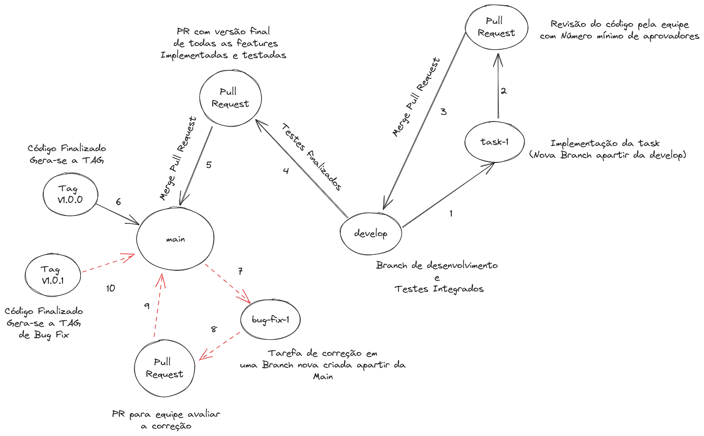


### PR (Pull Request)
Todos os PRs (Pull Requests) devem ter o corpo da mensagem abaixo:

Modelo: Features
```
Features:
  * Task X: Implementação da criação do item H
  * Task Y: Inclusão de novo endpoint na API W para cadastrar Z
```
Modelo: Bug Fix
```
Bug Fix
  * Task U.1: Correção do cadastro do item ABC
```

### Commits

Todos os commits devem contem uma das seguintes tags abaixo:

* *feat*: implementação de uma funcionalidade nova
* *fix*: correção de bugs
* *chore*: ajustes simples no código sem comprometer uma feature
* *style*: ajustes de identação, nome de variável ou remoção de imports não utilizados
* *docs*: alteração ou inclusão de documentação
* *ci*: alteração de pipelines
* *refactor*: refatoração de métodos e classes para uma melhor leitura do código ou desempenho
* *test*: inclusão de testes unitários ou de integração

Mensagem de todo commit:

Modelo
```
TAG_COMMIT: mensagem descrevendo o que foi feito no commit
```
Exemplo
```
feat: Foi criado novo endpoint na implementação de Y
```

---

## Gerar docker build

- Vá até o diretório da aplicação, onde se encontra o pom.xml

- Execute o comando maven para gerar o pacote

  ```bash
  mvn clean package
  ```

- Buildar o dockerfile, informando o Nome da imagem e a TAG, ao final o "." define que é para usar o dockerfile contino no diretório corrente

  ```bash
  docker build -t totem-food-service:1.0.0 .
  ```

- Para visualizar a imagem criada, basta listar com o comando ` docker images` 

- Para executar um container baseado na imagem gerada, basta executar o comando abaixo

  ```bash
  docker run -d -p 8080:8080 --name totem-food-service -t totem-food-service:1.0.0
  ```

- Para ver os logs, execute

  ```bash
  docker logs totem-food-service --follow
  ```

- Para matar a execução do container, execute

  ```bash
  docker rm -f totem-food-service
  ```

---

## Pipeline 

- Para análise de código e vulnerabilidade, utilizamos a ferramenta Sonar Cloud (https://sonarcloud.io/)

 #### Organization: https://sonarcloud.io/organizations/fiap-tech-challenge-4787bf24ba181ac258cb520837a657896a92044c/members
 
  